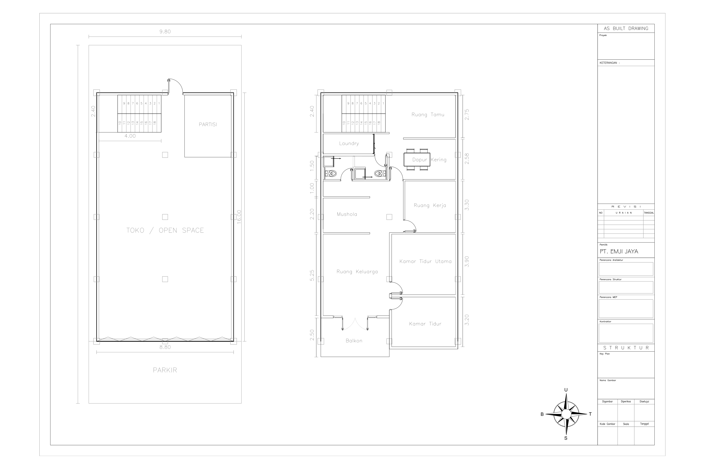

# 🏗️ EMJIJSYS

Repo dokumentasi dan analisis desain **ruko-hunian 2 lantai PT. EMJI JAYA**. Fokus repo ini adalah merapikan keputusan desain, analisis arsitektur, struktur, MEP, psikologi ruang, dan checklist menuju gambar kerja.



## ⚡ Quick Links

| Dokumen | Isi |
|---|---|
| [Analisis V2](docs/emjijsys-analisis-v2.md) | Analisis utama arsitektur, struktur, MEP, psikologi ruang |
| [Lantai 1](docs/lantai1.md) | Ringkasan struktur dan konsep lantai 1 |
| [Lantai 2](docs/lantai2.md) | Brainstorming hunian lantai 2, service room, ruang kerja, balkon |
| [Docs Index](docs/README.md) | Daftar dokumen dan aset |
| [TODO](TODO.md) | Roadmap revisi berikutnya |
| [PDF Model](assets/emjijsys-Model.pdf) | Sumber PDF model/as-built |

## 📌 Data Ringkas

| Item | Data |
|---|---:|
| Luas lahan | +/- 226 m2 |
| Lebar lahan | 9.80 m |
| Perkiraan panjang lahan | +/- 23.06 m |
| Footprint bangunan | 8.80 m x 16.00 m = 140.80 m2 |
| Fungsi lantai 1 | toko / open space |
| Fungsi lantai 2 | hunian privat |
| Grid konseptual | 3 x 5 titik kolom |

## 🧭 Arah Desain

- Lantai 1 dipertahankan fleksibel untuk usaha.
- Lantai 2 diarahkan menjadi hunian privat.
- Ruang tamu dekat tangga sebagai filter sosial.
- Area service/laundry dan kamar mandi dikelompokkan agar MEP efisien.
- Ruang keluarga dan balkon menjadi zona santai depan.
- Ruang kerja diperlakukan sebagai mini-lab, bukan sekadar meja laptop.

## 🚨 Prioritas Berikutnya

1. Overlay grid, kolom, dan balok lantai 2.
2. Cek semua dinding lantai 2 terhadap balok.
3. Detail void tangga dan balkon.
4. Kunci shaft plumbing untuk laundry + kamar mandi.
5. Rapikan layout pintu, koridor, dan area toilet.
6. Buat gambar MEP dasar: plumbing, listrik, exhaust, AC drain.
7. Rapikan CTB/lineweight untuk PDF A3.

## 📁 Struktur Repo

```text
emjijsys/
├─ README.md
├─ TODO.md
├─ assets/
│  ├─ emjijsys-Model.pdf
│  ├─ emjijsys_model_page1.png
│  ├─ lantai2_inspiration_layout.png
│  └─ ...
└─ docs/
   ├─ README.md
   ├─ emjijsys-analisis-v2.md
   ├─ lantai1.md
   ├─ lantai2.md
   └─ references/
      └─ emjijsys-antigravity-v2.md
```

## ⚠️ Disclaimer

Dokumen ini adalah analisis desain dan pra-gambar kerja. Ukuran, struktur, pondasi, balok, pelat, MEP, waterproofing, dan detail keselamatan tetap perlu diverifikasi oleh arsitek/engineer terkait sebelum konstruksi.
