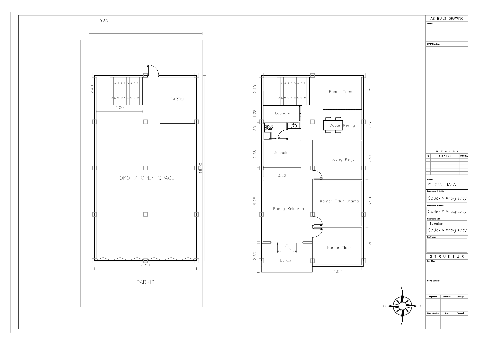

# 🏗️ EMJIJSYS Rev3 - Analisis Arsitektur, Psikologi Ruang, MEP, dan Estimasi Rangka Balok

Sumber utama: [`assets/emjijsys-rev3-Model.pdf`](../assets/emjijsys-rev3-Model.pdf)  
Preview gambar: [`assets/emjijsys_rev3_model_page1.png`](../assets/emjijsys_rev3_model_page1.png)  
Versi sebelumnya: [Analisis V2](emjijsys-analisis-v2.md)  
Objek kajian: ruko-hunian 2 lantai PT. EMJI JAYA  
Status: analisis konseptual pra-gambar kerja, bukan pengganti perhitungan struktur final



## ⚡ 0. TL;DR Rev3

Rev3 adalah langkah yang lebih matang dibanding v2. Keputusan menghapus kamar mandi kedua dan menggantinya dengan **1 KM shared + wastafel luar** membuat denah lebih realistis, lebih hemat maintenance, dan lebih sehat secara psikologis. Area basah menjadi lebih ringkas, plumbing lebih pendek, dan rumah tidak terasa kebanyakan ruang lembap.

| Area | Keputusan Rev3 | Evaluasi Cepat |
|---|---|---|
| 🧺 Laundry | tetap dekat tangga | bagus untuk service zone |
| 🚿 KM shared | 1 kamar mandi saja | lebih realistis daripada 2 KM kecil |
| 🧼 Wastafel luar | di depan/sekitar KM | bagus untuk tamu dan transisi higienis |
| 🤲 Mushola | di tengah kiri | lebih tenang, tidak langsung menyatu dengan tamu |
| 🛋️ Ruang keluarga | depan kiri dekat balkon | paling kuat secara psikologi ruang |
| 🛠️ Ruang kerja | kanan tengah | cocok untuk kerja fokus, perlu exhaust soldering |
| 🛏️ Kamar utama | kanan bawah tengah | cukup privat |
| 🛏️ Kamar tidur | kanan depan | perlu kontrol panas dan bukaan |
| 🧱 Struktur | grid 3 x 5 tetap rasional | perlu overlay balok untuk dinding rev3 |

Kesimpulan utama: **rev3 lebih efisien dan lebih rumah banget**. Tantangan berikutnya bukan zoning lagi, tetapi penguncian teknis: balok, shaft plumbing, floor drain, exhaust, bukaan, dan lineweight gambar kerja.

## 📌 1. Data Dasar yang Terbaca

| Item | Data |
|---|---:|
| Lebar lahan | 9.80 m |
| Lebar bangunan | 8.80 m |
| Panjang bangunan utama | 16.00 m |
| Footprint bangunan | 8.80 m x 16.00 m = 140.80 m2 |
| Area parkir depan | +/- 4.00 m dalam arah panjang |
| Tangga | +/- 2.40 m x 4.00 m |
| Lantai 2 sisi kanan | 2.75 + 2.58 + 3.30 + 3.90 + 3.20 m |
| Lantai 2 sisi kiri rev3 | 2.40 + 1.28 + 1.50 + 2.28 + 6.28 + 2.50 m |
| Lebar zona kiri tengah terbaca | +/- 3.22 m |
| Lebar kamar tidur kanan bawah terbaca | +/- 4.02 m |

Catatan: semua angka dari PDF perlu diverifikasi lagi di CAD dengan `DIST`. Untuk gambar kerja, semua ukuran sebaiknya dikunci dalam **mm**, bukan hanya meter di dimensi luar.

## 🧭 2. Orientasi dan Massa

Compass pada gambar menunjukkan:

| Arah Gambar | Orientasi |
|---|---|
| Atas | Utara |
| Kanan | Timur |
| Bawah | Selatan |
| Kiri | Barat |

Dengan pembacaan ini, parkir dan balkon berada di sisi selatan/depan. Massa bangunan memanjang utara-selatan. Lebar bangunan 8.80 m pada lahan 9.80 m menyisakan celah samping sekitar 500 mm kiri-kanan bila simetris. Celah ini lebih cocok sebagai talang/maintenance gap daripada koridor manusia.

Secara massa, ruko ini punya pola klasik:

- depan lantai 1 = publik/komersial;
- belakang lantai 1 = tangga dan ruang pendukung;
- lantai 2 = hunian privat;
- depan lantai 2 = ruang keluarga + balkon sebagai buffer fasad.

## 🏪 3. Analisis Lantai 1

Lantai 1 tetap berfungsi sebagai **toko / open space**. Denah ini kuat karena sederhana dan fleksibel. Kolom tengah memang muncul di area open space, tetapi masih bisa dijadikan elemen interior: island display, titik signage, CCTV, atau pembagi area kerja.

### Kekuatan

- Ruang toko luas dan mudah diubah.
- Area parkir depan jelas.
- Tangga berada di belakang sehingga hunian lantai 2 tidak langsung terekspos dari fasad.
- Struktur kolom terlihat cukup teratur untuk ruko 2 lantai.
- Partisi belakang kanan bisa dipakai sebagai kantor kecil/gudang/kasir.

### Risiko

- Akses hunian masih berpotensi bercampur dengan toko.
- Jika toko melibatkan karyawan/pelanggan, penghuni perlu transisi privat menuju tangga.
- Belum terlihat toilet lantai 1 yang jelas dalam rev3 PDF.
- Jalur evakuasi dan titik APAR belum dinotasikan.
- Partisi belakang kanan belum punya fungsi final.

### Saran

Minimal buat **threshold** sebelum tangga: pintu, partisi, kabinet, atau perubahan material lantai. Tujuannya bukan hanya fisik, tetapi psikologis: dari mode kerja masuk mode rumah 🏠.

## 🏠 4. Analisis Lantai 2 Rev3

Rev3 menunjukkan pembagian lantai 2 yang lebih matang:

```text
Belakang / Utara
┌──────────────────────────────┐
│ Tangga + Laundry + Ruang Tamu│
│ KM shared + wastafel luar    │
│ Mushola + Dapur Kering       │
│ Ruang Kerja                  │
│ Kamar Tidur Utama            │
│ Ruang Keluarga               │
│ Kamar Tidur + Balkon         │
└──────────────────────────────┘
Depan / Selatan
```

### 4.1 Zoning

| Zona | Ruang | Evaluasi |
|---|---|---|
| Publik terbatas | ruang tamu, dapur kering | tamu tertahan di belakang/tengah |
| Servis | laundry, KM shared, wastafel luar | plumbing ringkas dan mudah dirawat |
| Spiritual/tenang | mushola | cukup terlindung dari ruang tamu |
| Privat kerja | ruang kerja | fokus, perlu treatment MEP khusus |
| Privat tidur | kamar utama, kamar tidur | tidak langsung terekspos tamu |
| Restoratif | ruang keluarga, balkon | zona healing terbaik |

### 4.2 Sirkulasi Tamu

Siasat rev3 untuk tamu sudah lebih baik:

```text
Tangga
  -> Ruang Tamu
  -> Dapur Kering / meja makan
  -> Wastafel luar
  -> KM shared
```

Dengan alur ini, tamu bisa memakai KM tanpa masuk ke kamar tidur atau ruang keluarga depan. Wastafel luar juga menjadi buffer visual yang membuat pintu KM tidak terasa terlalu frontal.

Yang perlu dijaga:

- koridor depan KM minimal 900 mm bersih;
- pintu KM jangan bertabrakan dengan orang di wastafel;
- wastafel luar jangan terlalu menonjol ke jalur sirkulasi;
- pintu KM tidak menghadap langsung sofa ruang tamu atau meja makan.

### 4.3 Sirkulasi Keluarga

Alur keluarga:

```text
Tangga
  -> laundry / KM / dapur
  -> mushola
  -> ruang keluarga
  -> balkon / kamar
```

Ini baik karena ruang keluarga dan balkon tidak langsung menjadi area tamu. Keluarga tetap punya zona depan yang privat, terang, dan lebih santai.

## 🚿 5. Evaluasi Keputusan 1 Kamar Mandi

Keputusan menghapus KM kedua adalah keputusan rasional. Untuk 2 kamar tidur + 1 ruang kerja, **1 KM shared yang lebih nyaman** sering lebih baik daripada 2 KM kecil yang salah satunya lembap dan jarang dipakai.

### Kelebihan Rev3

- area basah lebih sedikit;
- risiko bocor lantai 2 turun;
- plumbing lebih pendek;
- exhaust lebih sederhana;
- rumah terasa lebih kering;
- maintenance lebih ringan;
- ruang bekas KM bisa menjadi buffer/storage;
- tamu tetap bisa akses KM lewat zona publik terbatas.

### Syarat agar 1 KM tidak terasa kurang

| Elemen | Rekomendasi |
|---|---:|
| Ukuran KM minimum | 1500 x 1800 mm |
| Ukuran KM nyaman | 1600 x 2200 mm atau 1800 x 2200 mm |
| Pintu KM | 750-800 mm |
| Shower | minimal 900 x 900 mm, ideal 900 x 1200 mm |
| Area kloset | minimal 800 x 1200 mm |
| Wastafel luar | lebar 600-800 mm, dalam 450-500 mm |
| Lantai KM | turun 20-30 mm |
| Slope | 1-2% ke floor drain |
| Exhaust | wajib |

### Catatan Psikologis

Satu KM shared akan tetap terasa nyaman jika pintunya tidak menjadi pusat perhatian. Wastafel luar adalah solusi bagus karena membentuk transisi: orang tidak langsung "masuk toilet", tetapi masuk ke area cuci tangan yang lebih netral.

## 🧺 6. Laundry dan Service Zone

Laundry dekat tangga tetap keputusan baik. Di rev3, laundry berada di atas cluster belakang kiri, dekat KM dan wastafel. Ini efisien untuk pipa air bersih, air bekas, floor drain, dan exhaust.

### Program ideal laundry

- mesin cuci 600 x 600 mm;
- sink utilitas kecil bila ruang cukup;
- rak deterjen tertutup;
- storage alat pel/sapu;
- keranjang laundry;
- floor drain;
- exhaust fan;
- kisi/roster untuk udara.

### Risiko

- lembap menyebar ke tangga;
- bau floor drain jika trap jelek;
- suara mesin cuci masuk ruang tamu;
- area laundry terlihat berantakan saat tamu datang.

### Siasat

- pintu/sliding screen pada laundry;
- lantai turun 20-30 mm;
- slope 1-2%;
- FD dengan trap;
- exhaust;
- kabinet tertutup untuk deterjen dan alat bersih.

## 🤲 7. Mushola

Mushola rev3 berada di tengah kiri, setelah area KM/laundry dan sebelum ruang keluarga. Ini cukup baik karena mushola tidak langsung menjadi area tamu, tapi masih dekat dengan wastafel/KM untuk wudu.

### Kekuatan

- posisi lebih tenang daripada dekat ruang tamu;
- ukuran sisi kiri sekitar 3.22 m memberi potensi ruang shalat yang layak;
- dekat area wudu/wastafel;
- bisa menjadi anchor emosional rumah.

### Risiko

- jika partisi terlalu terbuka, suara ruang keluarga mengganggu;
- jika partisi terlalu tertutup, ruang menjadi gelap/pengap;
- jangan sampai mushola menjadi lorong menuju ruang keluarga.

### Rekomendasi

- target ukuran efektif sekitar 3000 x 2200 mm;
- rak sajadah/mukena dalam 300-350 mm;
- partisi kisi atau dinding rendah;
- pencahayaan lembut;
- ventilasi pasif dari area keluarga atau atas.

## 🛋️ 8. Ruang Keluarga dan Balkon

Ruang keluarga di depan kiri adalah keputusan paling kuat secara psikologi. Ia menjadi ruang pemulihan setelah aktivitas usaha di lantai 1. Balkon memberi cahaya, udara, dan kontak visual ke luar.

### Kekuatan

- paling privat dari ruang tamu;
- dekat balkon;
- punya potensi cahaya alami;
- bisa menjadi pusat aktivitas keluarga;
- memberi jarak mental dari toko.

### Catatan layout

Ruang keluarga terlihat memanjang. Ini bisa terasa lega, tetapi juga bisa terasa seperti koridor besar jika furniture tidak dikunci. Perlu ada komposisi:

- sofa utama;
- meja kecil;
- storage TV/rak;
- karpet atau batas lantai;
- akses balkon tetap clear.

### Balkon

| Elemen | Rekomendasi |
|---|---:|
| Lebar nyaman | 1500 mm |
| Panjang nyaman untuk 2 orang | 3000 mm |
| Tinggi railing | 1000-1100 mm |
| Turun lantai dari ruang dalam | 20-30 mm |
| Slope | 1-2% ke floor drain |
| Waterproofing | wajib, naik ke dinding/parapet |

## 🛠️ 9. Ruang Kerja

Ruang kerja tetap berada di kanan tengah dengan kedalaman sekitar 3.30 m. Ini cukup baik untuk fungsi kerja privat dan soldering, tetapi perlu perlakuan teknis.

### Kebutuhan minimum

| Elemen | Rekomendasi |
|---|---:|
| Meja solder | dalam 700-800 mm |
| Panjang meja | 1600-2400 mm |
| Rak alat | dalam 350-450 mm |
| Jalur kursi | minimal 900 mm |
| Stopkontak | minimal 8 titik |
| Pencahayaan kerja | 4000-5000K |
| Exhaust soldering | fume extractor ducted ke luar |

### Psikologi ruang kerja

Pengguna sebaiknya bisa melihat pintu secara diagonal dari meja kerja. Ini memberi rasa kontrol dan mengurangi rasa "dikagetkan". Rak alat sebaiknya tidak langsung terlihat dari ruang tamu agar rumah tidak terasa seperti bengkel.

### Safety

- grounding wajib;
- MCB khusus ruang kerja;
- ELCB/RCD untuk perlindungan;
- APAR kecil dekat ruang kerja;
- meja tahan panas;
- kabel tidak melintang lantai.

## 🛏️ 10. Kamar Tidur Utama dan Kamar Tidur

### Kamar Tidur Utama

Kamar utama berada di kanan bawah tengah dengan kedalaman sekitar 3.90 m. Posisi ini cukup privat karena tidak langsung dekat tangga dan ruang tamu.

Prinsip ranjang:

- headboard di dinding solid;
- ranjang tidak sejajar langsung dengan pintu;
- pintu terlihat diagonal dari kasur;
- hindari kepala ranjang menempel dinding KM jika memungkinkan;
- wardrobe bisa menjadi buffer suara.

### Kamar Tidur Tambahan

Kamar tidur bawah kanan memiliki lebar terbaca sekitar 4.02 m dan kedalaman sekitar 3.20 m. Ini cukup baik untuk kamar anak/tamu.

Saran:

- kontrol panas dari fasad;
- jendela dengan shading;
- posisi AC tidak meniup langsung ke kepala ranjang;
- wardrobe 600 mm dalam;
- jalur depan lemari 800-900 mm.

## 🧠 11. Analisis Psikologi Arsitektur

### 11.1 Hierarki Privasi

Rev3 punya hierarki yang lebih sehat:

1. Tangga sebagai transisi.
2. Ruang tamu sebagai penerima.
3. Dapur kering sebagai semi-publik.
4. Wastafel luar + KM sebagai servis yang masih bisa diakses tamu.
5. Mushola sebagai zona tenang.
6. Ruang keluarga + balkon sebagai zona keluarga.
7. Kamar tidur dan ruang kerja sebagai zona privat.

Ini lebih baik daripada layout dengan 2 KM karena area basah tidak mendominasi ruang tengah.

### 11.2 Sense of Arrival

Setelah naik tangga, penghuni/tamu bertemu ruang tamu dan dapur kering. Ini memberi rasa disambut. Namun titik arrival perlu diperhalus dengan:

- lampu hangat;
- console table;
- kabinet sepatu;
- artwork;
- partisi halus agar toilet tidak menjadi view utama.

### 11.3 Prospect and Refuge

Ruang keluarga dan balkon memberi **prospect**: cahaya, udara, pandangan keluar. Kamar dan mushola memberi **refuge**: terlindung, tenang, privat. Kombinasi ini bagus untuk rumah di atas ruko.

### 11.4 Dual Identity Stress

Bangunan ruko-hunian punya risiko psikologis: penghuni sulit memisahkan mode kerja dan mode rumah. Rev3 membantu karena zona keluarga benar-benar ditarik ke depan dan lebih privat. Namun tangga tetap perlu dibuat sebagai momen transisi, bukan sekadar akses teknis.

### 11.5 Beban Kognitif

Rev3 mengurangi beban visual karena KM kedua dihapus. Ini bagus. Tetapi ruang keluarga memanjang dan ruang kerja penuh alat bisa tetap menciptakan clutter. Solusinya:

- storage tertutup;
- rak alat hanya di ruang kerja;
- laundry diberi pintu/screen;
- dapur kering pakai kabinet rapi.

## 🔌 12. Analisis MEP

### 12.1 Plumbing

Rev3 lebih baik untuk plumbing karena semua area basah berkumpul:

```text
Laundry
  -> Wastafel luar
  -> KM shared
  -> Shaft plumbing
```

Rekomendasi:

| Sistem | Rekomendasi |
|---|---:|
| Shaft plumbing | 300 x 600 mm atau 400 x 400 mm |
| Pipa WC | PVC 100-110 mm |
| Air bekas wastafel/shower/laundry | PVC 50-75 mm |
| Vent pipe | naik ke atap |
| Floor drain | KM, laundry, balkon |
| Trap | wajib untuk FD dan wastafel |

### 12.2 Elektrikal

Sirkuit yang disarankan:

| Sirkuit | Catatan |
|---|---|
| Lampu lantai 2 | terpisah dari stopkontak |
| Stopkontak umum | ruang tamu, keluarga, kamar |
| AC kamar utama | dedicated |
| AC kamar tidur | dedicated |
| AC ruang kerja | dedicated |
| Ruang kerja/soldering | dedicated + grounding |
| Mesin cuci | dedicated + ELCB/RCD |
| Pantry/dapur kering | dedicated |
| Area basah | ELCB/RCD 30 mA |

### 12.3 Ventilasi dan Exhaust

| Area | Risiko | Solusi |
|---|---|---|
| KM shared | bau/lembap | exhaust fan + FD trap |
| Laundry | lembap dan suara | exhaust + screen |
| Dapur kering | bau/uap | cooker hood/exhaust |
| Ruang kerja | asap solder | fume extractor ducted |
| Area tengah | gelap/pengap | roster/skylight/bukaan atas |
| Balkon | air hujan | slope + FD |

## 🧱 13. Estimasi Rangka Balok Bangunan

Estimasi ini memakai asumsi grid konseptual 8.80 m x 16.00 m:

| Arah | Grid | Bentang |
|---|---|---:|
| Lebar | 1-2-3 | 4400 mm + 4400 mm |
| Panjang | A-B-C-D-E | 4000 mm x 4 |
| Titik kolom | 15 titik | 3 x 5 |

Skema grid:

```text
Utara / belakang
E  K13 ----- K14 ----- K15
   |         |         |
D  K10 ----- K11 ----- K12
   |         |         |
C  K7  ----- K8  ----- K9
   |         |         |
B  K4  ----- K5  ----- K6
   |         |         |
A  K1  ----- K2  ----- K3
Selatan / depan
```

### 13.1 Estimasi Kolom

| Posisi | Jumlah | Ukuran konseptual |
|---|---:|---:|
| Kolom sudut | 4 titik | 400 x 400 mm |
| Kolom tepi/tengah | 11 titik | 350 x 350 mm |
| Total | 15 titik | final ikut hitung struktur |

Catatan: bila bangunan disiapkan untuk 3 lantai, kolom dan pondasi harus dihitung untuk beban penuh 3 lantai sejak awal.

### 13.2 Estimasi Balok Grid Utama per Lantai

| Jenis balok | Perhitungan | Panjang |
|---|---:|---:|
| Balok arah lebar pada grid A-E | 5 baris x 2 bentang x 4.40 m | 44.00 m |
| Balok arah panjang pada grid 1-3 | 3 garis x 4 bentang x 4.00 m | 48.00 m |
| Total balok grid utama | 44.00 + 48.00 m | 92.00 m |

Ukuran konseptual awal:

| Kode | Fungsi | Ukuran awal |
|---|---|---:|
| B1 | balok induk arah lebar | 250 x 500 mm |
| B2 | balok induk arah panjang | 250 x 500 mm |
| B1/B2 opsi tumbuh 3 lantai | bentang utama | 300 x 500 mm atau sesuai hitung |

### 13.3 Balok Tepi Void Tangga

Tangga terbaca sekitar 2.40 m x 4.00 m. Jika void mengikuti bidang ini, keliling void adalah:

```text
2 x (2.40 + 4.00) = 12.80 m
```

Sebagian sisi void mungkin sudah berimpit dengan balok grid, sehingga tambahan balok aktual bisa lebih kecil. Namun secara prinsip, semua sisi bukaan tangga harus punya balok tepi.

| Kode | Fungsi | Panjang estimasi | Ukuran awal |
|---|---|---:|---:|
| BV | balok tepi void tangga | +/- 8-13 m | 250 x 450 mm atau 250 x 500 mm |

### 13.4 Balok Balkon

Balkon depan berada pada zona kiri depan. Dimensi pasti perlu `DIST`, tetapi dari pembacaan rev3, area balkon berkisar 2.50 m dalam arah panjang dan lebar efektif sekitar 3.20-4.80 m tergantung garis tepi yang dipakai.

Estimasi balok balkon:

| Elemen | Panjang estimasi |
|---|---:|
| Balok tepi depan balkon | +/- 3.20-4.80 m |
| Balok sisi balkon | +/- 2 x 2.50 m |
| Total balok balkon | +/- 8.20-9.80 m |

Ukuran awal:

| Kode | Fungsi | Ukuran awal |
|---|---|---:|
| BB | balok balkon / kantilever | 250 x 500 mm |
| BB opsi kantilever berat | jika banyak pot/railing berat | 250 x 600 mm atau sesuai hitung |

Catatan penting: balkon berpotensi kantilever/semi-kantilever. Tulangan atas/negatif di tumpuan wajib dihitung, jangan hanya mengikuti dimensi visual.

### 13.5 Balok Anak untuk Partisi Lantai 2

Rev3 memiliki beberapa dinding partisi yang tidak semuanya tepat di grid 4.00 m. Dinding kanan seperti batas ruang kerja, kamar utama, dan kamar tidur perlu dicek apakah jatuh di atas balok. Bila tidak, perlu balok anak.

Estimasi kasar:

| Area partisi | Panjang estimasi |
|---|---:|
| Batas ruang kerja - kamar utama | +/- 4.00-4.40 m |
| Batas kamar utama - kamar tidur | +/- 4.00-4.40 m |
| Batas dapur/ruang tamu - ruang kerja | +/- 4.00-4.40 m |
| Partisi KM/laundry/wastafel | +/- 10-16 m |
| Partisi mushola/ruang keluarga | +/- 6-10 m |
| Total balok anak konseptual | +/- 28-40 m |

Ukuran awal:

| Kode | Fungsi | Ukuran awal |
|---|---|---:|
| BA | balok anak dinding partisi | 200 x 350 mm |
| BA area basah | support dinding KM/laundry | 200 x 400 mm |

### 13.6 Ringkasan Panjang Balok Konseptual per Level Lantai 2

| Komponen | Panjang estimasi |
|---|---:|
| Balok grid utama | 92.00 m |
| Balok tepi void tangga | 8-13 m |
| Balok balkon | 8-10 m |
| Balok anak partisi | 28-40 m |
| Total konseptual | +/- 136-155 m |

Ini adalah estimasi panjang balok untuk level lantai 2/pelat lantai 2. Untuk ring balok atap, panjangnya bergantung apakah atap memakai dak beton penuh, rangka baja ringan, atau struktur atap lain.

### 13.7 Estimasi Volume Beton Balok Konseptual

Hitungan kasar, belum final:

| Komponen | Asumsi ukuran | Panjang | Volume kasar |
|---|---:|---:|---:|
| Balok grid utama | 250 x 500 mm | 92 m | +/- 11.50 m3 |
| Balok void | 250 x 450 mm | 10 m rata-rata | +/- 1.13 m3 |
| Balok balkon | 250 x 500 mm | 9 m rata-rata | +/- 1.13 m3 |
| Balok anak | 200 x 350 mm | 34 m rata-rata | +/- 2.38 m3 |
| Total kasar | - | - | +/- 16.14 m3 |

Catatan: volume real bisa berubah karena overlap balok-kolom, integrasi dengan pelat, dimensi final, dan metode pengecoran.

### 13.8 Arah Tulangan Konseptual

Ini bukan shop drawing, hanya arahan awal diskusi:

| Elemen | Arahan awal |
|---|---|
| Balok induk 250/500 | tulangan utama D16-D19 sesuai hitung |
| Balok anak 200/350 | tulangan utama D13-D16 sesuai hitung |
| Sengkang | Ø8 atau Ø10, rapat di daerah tumpuan |
| Balok balkon | tulangan atas/negatif wajib dominan |
| Balok tepi void | perlu detailing sudut bukaan |
| Kolom 400/400 | tulangan utama minimal kelas D16/D19 sesuai beban |
| Kolom 350/350 | tulangan utama D16 konseptual, final engineer |

Wajib dihitung engineer struktur, terutama bila bangunan dipersiapkan tumbuh 3 lantai.

## 🔊 14. Akustik, Bau, Kelembapan

### Akustik

Risiko suara:

- toko lantai 1 naik lewat tangga;
- mesin cuci dekat tangga;
- ruang keluarga ke mushola;
- jalan depan ke kamar tidur dan balkon.

Solusi:

- pintu transisi tangga;
- anti-vibration pad mesin cuci;
- pintu solid kamar;
- wardrobe sebagai buffer;
- partisi mushola yang tidak memantulkan suara keras.

### Bau dan Kelembapan

Rev3 lebih baik karena hanya ada satu KM. Namun karena KM, wastafel, dan laundry terkumpul, exhaust tetap wajib.

Solusi:

- FD dengan trap;
- exhaust KM;
- exhaust laundry;
- kabinet deterjen tertutup;
- pintu laundry/screen;
- ventilasi area wastafel luar.

## 🔥 15. Keselamatan dan Evakuasi

Untuk ruko-hunian, keselamatan tidak boleh dianggap belakangan.

Checklist:

- APAR lantai 1 dekat toko;
- APAR lantai 2 dekat ruang kerja/pantry;
- smoke detector dekat tangga dan ruang keluarga;
- jalur tangga bebas barang;
- ELCB/RCD untuk area basah;
- stopkontak ruang kerja grounded;
- lampu tangga cukup terang;
- balkon tidak dianggap jalur evakuasi utama kecuali ada detail khusus.

## 🌿 16. Iklim, Cahaya, dan Kenyamanan Termal

Area depan mendapat peluang cahaya dari balkon. Area tengah seperti mushola, koridor, dan ruang kerja perlu strategi tambahan.

Rekomendasi:

- bukaan balkon untuk ruang keluarga;
- shading pada fasad depan;
- roster/skylight kecil di area tengah bila memungkinkan;
- exhaust untuk KM/laundry/dapur/ruang kerja;
- warna interior terang di area tengah;
- AC kamar dan ruang kerja disiapkan, tetapi ventilasi pasif tetap diusahakan.

## 📐 17. Catatan Gambar Kerja

Yang perlu ditambahkan pada CAD rev3:

- grid angka `1-3`;
- grid huruf `A-E`;
- kode kolom `K1-K15`;
- notasi elevasi `+/-0.00`, `+3600`, turun KM/laundry/balkon;
- dimensi bersih tiap ruang dalam mm;
- arah bukaan pintu;
- jendela/ventilasi;
- layout furniture utama;
- denah balok lantai 2;
- denah MEP;
- detail KM shared;
- detail wastafel luar;
- detail service room/laundry;
- detail balkon dan railing;
- potongan tangga.

## 🚨 18. Risiko Prioritas Rev3

| Prioritas | Risiko | Dampak | Tindakan |
|---:|---|---|---|
| 1 | dinding rev3 tidak tepat di atas balok | retak/pelat terbebani | overlay balok-kolom |
| 2 | void tangga tidak diberi balok tepi | retak sudut void | detail balok void |
| 3 | KM/laundry bocor | merusak lantai 1 | waterproofing + slope + FD |
| 4 | balkon bocor/kantilever lemah | bahaya struktur/finishing | detail balok balkon |
| 5 | pintu KM dan wastafel mengganggu koridor | tidak nyaman harian | simulasi swing pintu |
| 6 | ruang kerja tanpa exhaust | risiko kesehatan | fume extractor ducted |
| 7 | ruang keluarga jadi koridor besar | psikologis kurang nyaman | kunci furniture dan zoning |
| 8 | akses hunian masih campur toko | privasi lemah | threshold tangga |

## ✅ 19. Kesimpulan Rev3

Rev3 adalah versi yang lebih sehat dan realistis. Mengurangi dua kamar mandi menjadi satu KM shared membuat denah lebih efisien, lebih kering, dan lebih mudah dirawat. Wastafel luar adalah keputusan cerdas karena membantu tamu, memperbaiki transisi visual, dan memberi alasan arsitektural untuk dinding pemisah.

Secara psikologis, rev3 lebih kuat karena ruang keluarga dan balkon tetap menjadi zona privat keluarga, sementara tamu masih punya akses wajar ke KM tanpa masuk kamar. Mushola juga berada di posisi yang cukup tenang.

Secara struktur, grid 3 x 5 masih rasional. Estimasi balok utama per level sekitar 92 m, dan jika ditambah balok void, balkon, serta balok anak partisi, total konseptual bisa berada di kisaran **136-155 m**. Angka ini harus diverifikasi dengan CAD dan dihitung engineer.

Langkah berikutnya yang paling tepat:

1. buat overlay struktur rev3;
2. kunci shaft plumbing;
3. finalkan ukuran KM shared;
4. simulasi swing pintu dan koridor;
5. detail balkon/tangga;
6. baru masuk ke fasad dan interior.
