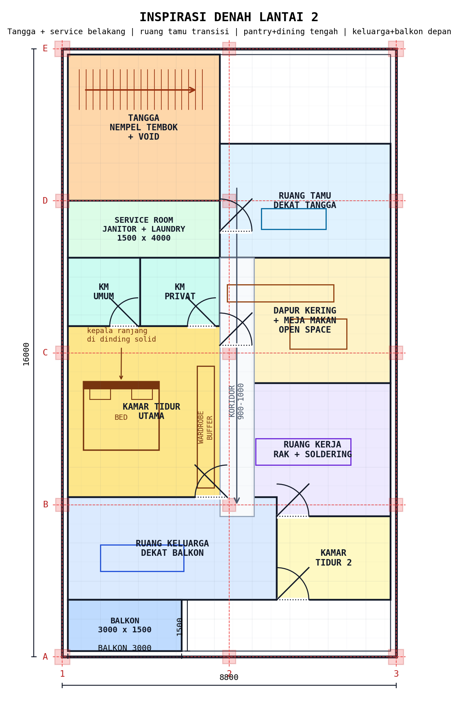
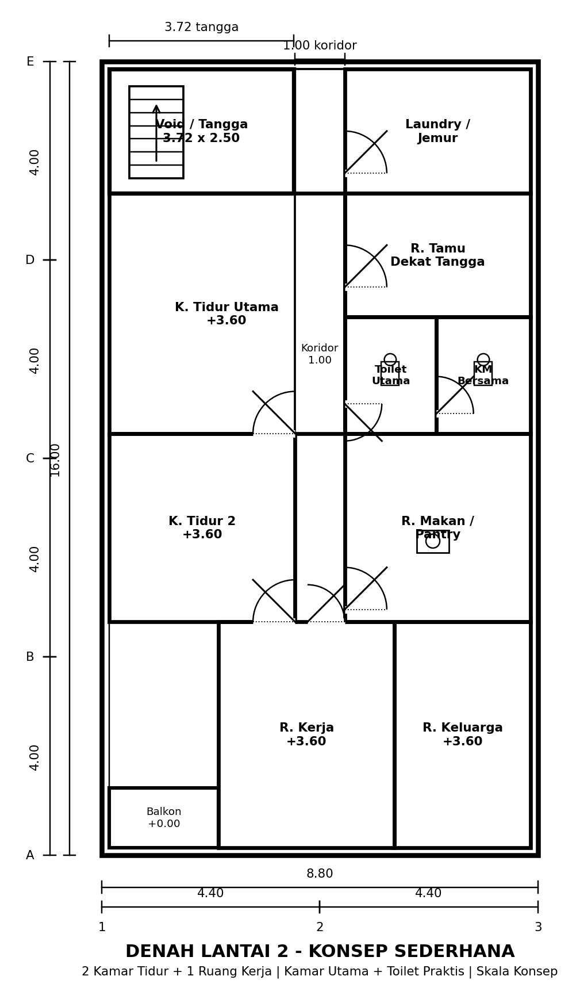
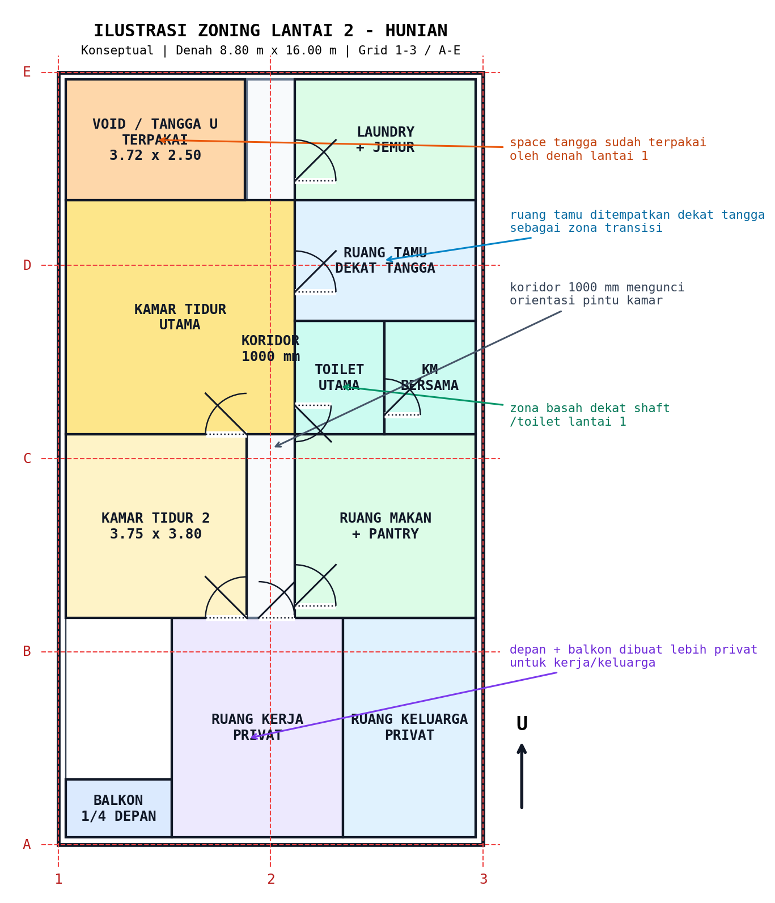
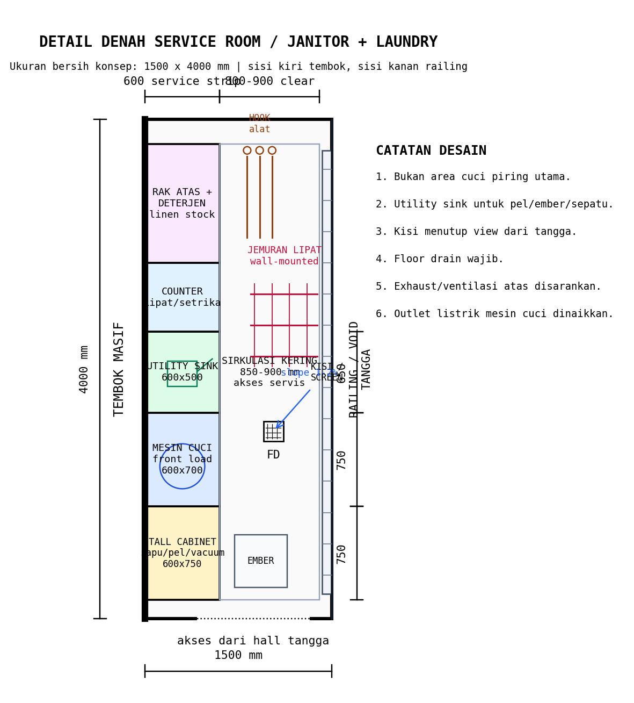
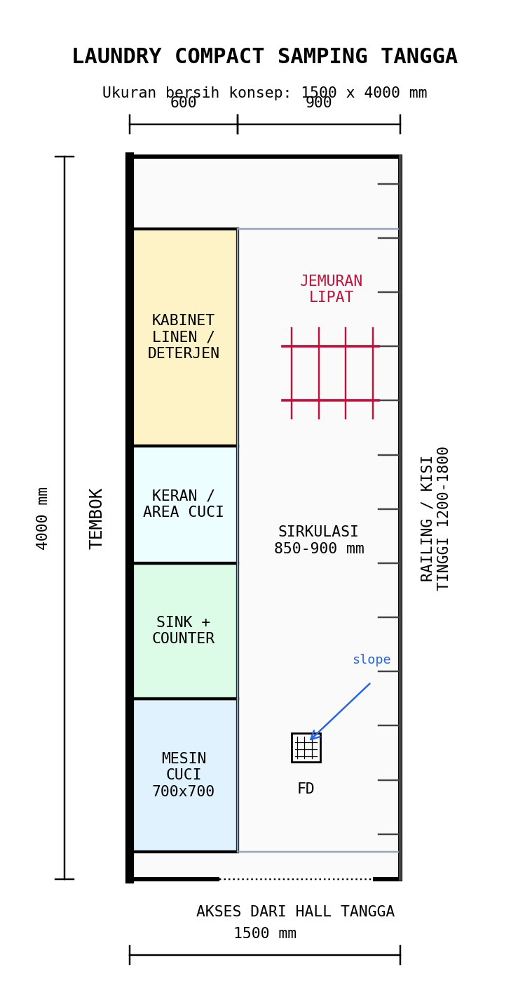

# Brainstorming Lantai 2 - Hunian Ruko

## Status Dokumen

Dokumen ini adalah brainstorming awal untuk lantai 2 sebagai area hunian. Data lantai 2 belum final, sehingga semua pembagian ruang, ukuran ruang, dan posisi bukaan di bawah ini masih berupa konsep yang perlu dikunci melalui denah kerja.

Acuan yang sudah tersedia:

| Item | Data |
|---|---:|
| Lebar bangunan | 8.80 m |
| Panjang bangunan | 16.00 m |
| Modul struktur | 3 x 5 grid |
| Span arah lebar | 4400 mm + 4400 mm |
| Span arah panjang | 4000 mm x 4 bentang |
| Elevasi lantai 1 | +/- 0.00 |
| Asumsi elevasi lantai 2 | +3.60 m |
| Tangga dari lantai 1 | Revisi konsep: tangga siku / L-shape |

## Koreksi Penting: Space Tangga Sudah Terpakai

Area lantai 2 tidak boleh dihitung sebagai bidang kosong penuh 8.80 m x 16.00 m, karena zona tangga dari lantai 1 sudah mengunci ruang di belakang kiri.

| Elemen | Ukuran | Luas |
|---|---:|---:|
| Luas bruto lantai 2 dalam envelope bangunan | 8.80 m x 16.00 m | 140.80 m2 |
| Void / zona tangga awal U terpakai | 3.72 m x 2.50 m | 9.30 m2 |
| Varian tangga siku / L-shape | +/- 3.40 m x 3.20 m | +/- 10.88 m2 |
| Hall/sirkulasi keluar tangga minimum | +/- 1.00-2.00 m x 2.50 m | +/- 3.00-5.00 m2 |
| Koridor utama hunian | lebar 1000 mm x panjang konseptual +/- 11.15 m | +/- 11.15 m2 |
| Luas efektif awal setelah tangga + hall + koridor | perkiraan | +/- 115.00 m2 |

Implikasi desain:

- Zona belakang kiri harus dianggap sebagai area tangga/void/hall, bukan kamar.
- Kamar utama, laundry, atau area servis belakang harus menyesuaikan sisa bidang di kanan tangga.
- Koridor lantai 2 perlu dimulai dari hall tangga, lebar rasional 1000 mm, lalu menyebar ke ruang keluarga/kamar.
- Kamar mandi lantai 2 tetap ideal dekat zona tangga/toilet lantai 1 agar plumbing pendek.
- Orientasi pintu kamar sebaiknya membuka dari koridor ke dalam kamar. Pintu kamar mandi disarankan membuka keluar atau memakai pintu geser agar aman saat kondisi darurat.

## Ilustrasi Zoning Konseptual

### Inspirasi Layout Terbaru

Konsep ini mengikuti arah diskusi terbaru:

- Tangga dan service room berada di belakang.
- Service room menjadi janitor + laundry compact.
- Dua kamar mandi berada di selatan service area: KM umum dan KM privat.
- Ruang tamu dekat tangga sebagai area transisi.
- Dapur kering + meja makan berada dekat ruang tamu/foyer.
- Ruang keluarga berada di depan, dekat balkon 3000 x 1500 mm.
- Ruang kerja dibuat privat, cukup untuk rak dan soldering tools.

### Sketsa Denah Sederhana

Sketsa ini mengikuti gaya denah referensi: dinding tebal, dimensi luar, label ruang, koridor 1000 mm, orientasi pintu, dan footprint tangga dari lantai 1.

### Zoning Warna

Catatan: ilustrasi ini hanya sketsa zoning awal untuk brainstorming hunian. Posisi tangga sudah dikoreksi agar mengikuti footprint tangga lantai 1 di belakang kiri. Ukuran ruang, posisi pintu, bukaan, dan partisi masih perlu dikunci pada denah kerja.

## Prinsip Utama Hunian

- Lantai 2 difokuskan sebagai hunian keluarga, bukan area komersial.
- Ruang privat ditempatkan lebih ke belakang dan samping agar tidak terlalu terekspos dari fasad depan.
- Area servis basah, seperti kamar mandi, laundry, dan pantry, sebaiknya ditumpuk atau dekat dengan toilet lantai 1 untuk efisiensi plumbing.
- Bukaan depan dan belakang dimaksimalkan untuk ventilasi silang.
- Jalur sirkulasi dari tangga harus langsung terbaca dan tidak memotong area kamar secara canggung.
- Dinding baru sebaiknya mengikuti grid struktur atau posisi balok agar beban partisi lebih mudah dikendalikan.
- Footprint tangga lantai 1 harus dikunci sebagai area terpakai lantai 2. Untuk revisi terbaru, prioritasnya adalah varian tangga siku / L-shape agar ruang belakang lebih mudah ditata.
- Koridor utama harus digambar sebagai ruang nyata, bukan sisa ruang antar kamar.
- Orientasi pintu harus dicek agar daun pintu tidak saling tabrak, tidak membuka ke area tangga, dan tidak menghalangi jalur evakuasi.

## Program Ruang Usulan Final Sederhana

| Ruang | Ukuran Konseptual | Luas | Catatan |
|---|---:|---:|---|
| Kamar tidur utama | +/- 4.75 m x 4.85 m | +/- 23.04 m2 | Termasuk akses ke toilet praktis dalam |
| Toilet praktis kamar utama | +/- 1.85 m x 2.35 m | +/- 4.35 m2 | Closet, shower, wastafel kecil |
| Kamar tidur 2 | +/- 3.75 m x 3.80 m | +/- 14.25 m2 | Kamar anak/tamu keluarga |
| Ruang kerja privat | +/- 3.55 m x 4.55 m | +/- 16.15 m2 | Area depan, mendapat cahaya fasad |
| Ruang keluarga privat | +/- 2.75 m x 4.55 m | +/- 12.51 m2 | Area depan kanan |
| Ruang tamu | +/- 3.75 m x 2.50 m | +/- 9.38 m2 | Dekat tangga sebagai zona transisi |
| Ruang makan + pantry | +/- 3.75 m x 3.80 m | +/- 14.25 m2 | Di kanan koridor, dekat KM |
| Kamar mandi bersama | +/- 1.90 m x 2.35 m | +/- 4.47 m2 | Untuk tamu dan kamar tidur 2 |
| Laundry / jemur | 1.80 m x 3.00 m | 5.40 m2 | Ideal dekat belakang |
| Balkon depan kecil | +/- 2.20 m x 1.20 m | +/- 2.64 m2 | Elemen fasad, bukan ruang tamu |
| Koridor/sirkulasi | lebar 1000 mm disarankan | +/- 11.15 m2 konseptual | Minimal nyaman 900 mm, lebih baik 1000-1200 mm |
| Void/hall tangga | footprint tetap | +/- 14.30 m2 | Mengikuti tangga lantai 1 + area keluar tangga |

Catatan ukuran:
- Kamar tidur minimal praktis untuk hunian keluarga disarankan tidak kurang dari sekitar 3000 x 3000 mm.
- Kamar mandi 1800 x 2200 mm cukup untuk shower, closet, dan wastafel kecil.
- Koridor 900 mm masih bisa dipakai, tetapi 1000-1200 mm lebih nyaman.

## Koridor dan Orientasi Pintu

Koridor harus diperlakukan sebagai elemen desain utama lantai 2 karena tangga berada di belakang kiri. Jalur paling rasional adalah koridor tulang punggung dari hall tangga menuju ruang tengah/depan.

| Elemen | Rekomendasi |
|---|---:|
| Lebar koridor minimum | 900 mm |
| Lebar koridor disarankan | 1000-1200 mm |
| Lebar pintu kamar tidur | 800-900 mm |
| Lebar pintu kamar mandi | 700-800 mm |
| Lebar pintu servis/laundry | 700-800 mm |

Aturan orientasi pintu:

- Pintu kamar tidur membuka ke dalam kamar, dari arah koridor.
- Pintu kamar mandi sebaiknya membuka keluar atau menggunakan pintu geser.
- Pintu laundry/area jemur boleh membuka ke luar area basah atau geser bila ruang sempit.
- Daun pintu tidak boleh membuka langsung ke anak tangga.
- Dua pintu berseberangan di koridor harus dicek agar swing tidak bertabrakan.
- Area depan pintu minimal menyisakan ruang berdiri yang layak, tidak langsung menabrak furniture.

## Opsi Pemangkasan Balkon untuk Ruang Kerja

Balkon penuh selebar fasad tidak wajib. Untuk mendukung ruang kerja lantai 2, balkon lebih rasional dipangkas menjadi elemen fasad dan ventilasi saja.

| Opsi Balkon | Ukuran Konseptual | Luas | Dampak ke Ruang Kerja |
|---|---:|---:|---|
| Balkon penuh | 8.50 m x 1.20 m | 10.20 m2 | Ruang kerja depan lebih kecil |
| Balkon setengah | +/- 4.25 m x 1.20 m | +/- 5.10 m2 | Kompromi: masih kuat sebagai fasad, ruang kerja bertambah |
| Balkon 1/4 | +/- 2.20 m x 1.20 m | +/- 2.64 m2 | Paling efisien untuk memperbesar ruang kerja |

Rekomendasi saat ini:

- Gunakan balkon 1/4 atau setengah, bukan balkon penuh.
- Bila ruang kerja menjadi prioritas, balkon 1/4 lebih rasional.
- Balkon 1/4 tetap bisa dipakai untuk bukaan, tanaman kecil, dan aksen fasad.
- Ruang kerja depan dapat mengambil area bekas balkon sehingga lebih nyaman untuk meja kerja, rak, dan kursi tamu kecil.
- Pintu ruang kerja sebaiknya menghadap koridor, bukan langsung ke balkon.
- Bukaan ruang kerja tetap perlu jendela besar ke depan untuk cahaya alami.
- Area depan dan balkon diperlakukan sebagai zona privat, bukan area menerima tamu utama.
- Ruang tamu lebih baik ditempatkan dekat tangga/hall sebagai zona transisi antara akses dan hunian privat.

Catatan teknis:

- Balkon tetap perlu kemiringan lantai ke floor drain atau pembuangan air hujan.
- Detail waterproofing balkon wajib dibuat.
- Railing balkon minimal harus aman secara fungsi, tinggi konseptual 1000-1100 mm sebelum detail final.
- Balok balkon harus dicek struktur karena menjadi elemen kantilever atau semi-kantilever.

## Zoning Konsep

### Zona Depan

Fungsi yang cocok:

- Ruang kerja privat.
- Ruang keluarga privat.
- Balkon kecil sebagai bukaan, taman kecil, dan elemen fasad.

Alasan:

- Mendapat cahaya dan udara dari fasad depan.
- Secara visual bisa memperkuat tampak ruko.
- Lebih cocok dibuat privat karena jauh dari tangga dan tidak langsung menerima tamu.
- Mendukung ruang kerja yang lebih tenang dan tidak terganggu sirkulasi tamu.

### Zona Tengah

Fungsi yang cocok:

- Area tangga datang.
- Ruang tamu / ruang transisi dekat tangga.
- Ruang makan kecil bila diperlukan.
- Pantry kering.
- Koridor penghubung kamar.

Alasan:

- Zona tengah menjadi simpul sirkulasi.
- Dekat dengan tangga, jadi perlu layout yang bersih dan tidak sempit.
- Cocok untuk menerima tamu tanpa membawa tamu terlalu jauh ke zona privat depan/kamar.
- Membantu memisahkan area publik terbatas dari ruang kerja dan ruang keluarga privat.

### Zona Belakang

Fungsi yang cocok:

- Kamar tidur utama.
- Laundry dan jemur.
- Kamar mandi.
- Area servis ringan.

Alasan:

- Lebih privat.
- Dekat sisa lahan belakang untuk ventilasi dan pembuangan udara.
- Area basah lebih mudah diarahkan ke belakang atau ditumpuk dengan toilet lantai 1.

## Opsi Layout

## Skema Terpilih - 2 Kamar Tidur + 1 Ruang Kerja

Konsep:

- Depan: ruang kerja privat, ruang keluarga privat, balkon kecil.
- Tengah: koridor 1000 mm, kamar tidur 2, ruang makan + pantry, KM bersama.
- Belakang: kamar tidur utama dengan toilet praktis dalam, ruang tamu dekat tangga, laundry/jemur.

Kelebihan:

- Layout lebih sederhana dan mudah dibaca.
- Area depan lebih privat dan mendukung kerja fokus.
- Ruang tamu dekat tangga sehingga tamu tidak masuk ke area privat.
- Kamar utama lebih nyaman karena memiliki toilet praktis dalam.
- Jumlah ruang basah masih terkendali: toilet utama + KM bersama.

Kekurangan:

- Plumbing perlu dirancang rapi karena ada 2 kamar mandi di lantai 2.
- Koridor tetap mengambil area sekitar +/- 11 m2.
- Ruang keluarga privat lebih kompak karena sebagian depan diberikan ke ruang kerja.

Skala gambar:

- Denah lantai 2: 1:100.
- Detail kamar mandi/laundry: 1:20 atau 1:25.

## Opsi Cadangan - 2 Kamar Tidur Lebih Lega Tanpa Toilet Dalam

Konsep:

- Depan: ruang keluarga besar + balkon.
- Tengah: pantry, ruang makan kecil, kamar mandi.
- Belakang: kamar utama dan kamar anak.

Kelebihan:

- Hunian terasa lebih lapang.
- Ruang keluarga dan ruang makan lebih nyaman.
- Lebih mudah mendapatkan ventilasi silang.

Kekurangan:

- Kapasitas kamar lebih sedikit.
- Kurang fleksibel jika keluarga bertambah.

Skala gambar:

- Denah lantai 2: 1:100.
- Potongan ruang keluarga dan balkon: 1:50.

## Opsi C - Semi-Boarding / Kamar Sewa Kecil

Konsep:

- 3 sampai 4 kamar kecil.
- Kamar mandi bersama.
- Area komunal kecil dekat tangga.

Kelebihan:

- Lebih produktif secara ekonomi.
- Cocok jika ruko dipakai usaha dan hunian campuran.

Kekurangan:

- Privasi lebih rendah.
- Beban MEP meningkat.
- Perlu kontrol ventilasi, kebisingan, dan akses.

Catatan:

- Opsi ini perlu keputusan fungsi bangunan yang lebih jelas sebelum digambar.

## Rekomendasi Awal

Untuk ruko hunian keluarga, opsi paling seimbang adalah Opsi B jika prioritasnya kenyamanan, atau Opsi A jika prioritasnya jumlah kamar.

Rekomendasi awal yang rasional:

- 2 kamar tidur.
- 1 ruang kerja privat di depan.
- 1 toilet praktis dalam kamar utama.
- 1 kamar mandi bersama.
- Ruang tamu dekat tangga.
- Pantry + ruang makan.
- Laundry/jemur belakang.
- Balkon kecil 1/4 fasad.

## Struktur Lantai 2

### Grid

- Gunakan grid yang sama dengan lantai 1: angka 1-3 dan huruf A-E.
- Partisi utama sebaiknya mengikuti garis grid atau berada dekat balok.
- Bukaan besar jangan memotong posisi kolom.

### Kolom

| Elemen | Ukuran Konseptual |
|---|---:|
| Kolom utama lanjutan | 400 x 400 mm |
| Kolom antara lanjutan | 350 x 350 mm |

Catatan:

- Kolom lantai 2 idealnya menerus dari kolom lantai 1.
- Jangan menggeser kolom tanpa perhitungan struktur.
- Untuk struktur tumbuh 3 lantai, detail tulangan harus dihitung tersendiri.

### Balok dan Pelat

| Elemen | Ukuran Konseptual |
|---|---:|
| Balok induk grid | 250 x 500 mm atau 300 x 500 mm |
| Balok anak | 200 x 350 mm atau sesuai bentang |
| Pelat lantai | 120 mm |
| Balok balkon | minimal 200 x 350 mm, final ikut bentang |

Catatan:

- Ukuran balok di atas adalah acuan konseptual, bukan final hitungan struktur.
- Area tangga dan balkon perlu detail balok khusus.
- Jika ada dinding bata di lantai 2, posisi dinding sebaiknya berada di atas balok.

## Arsitektur

### Denah

Elemen wajib:

- Nama ruang.
- Ukuran ruang dalam mm.
- Grid angka dan huruf.
- Notasi elevasi lantai 2: +3.60.
- Arah bukaan pintu.
- Simbol jendela dan ventilasi.
- Dimensi total dan dimensi antar grid.

Skala:

- Denah lantai 2: 1:100 atau 1:50.

### Tampak

Elemen yang perlu dipikirkan:

- Balkon depan sebagai elemen fasad.
- Komposisi jendela kamar dan ruang keluarga.
- Secondary skin atau kisi bila arah panas matahari dominan.
- Talang dan pipa tegak air hujan.

Skala:

- Tampak depan/belakang/samping: 1:100 atau 1:50.

### Potongan

Potongan minimal:

- Potongan A-A melewati tangga.
- Potongan B-B melewati kamar mandi/laundry.

Elemen wajib:

- Elevasi +0.00 lantai 1.
- Elevasi +3.60 lantai 2.
- Elevasi plafon lantai 2.
- Tinggi kusen pintu/jendela.
- Ketebalan pelat lantai.
- Balok utama yang terpotong.

Skala:

- Potongan: 1:50.

### Detail

Detail prioritas:

- Detail kamar mandi lantai 2.
- Detail balkon.
- Detail railing tangga/balkon.
- Detail kusen jendela depan.
- Detail waterproofing area basah.

Skala:

- Detail: 1:5, 1:10, atau 1:20.

## MEP

### Plumbing

Prinsip:

- Kamar mandi lantai 2 sebaiknya dekat atau di atas zona toilet lantai 1.
- Pipa air kotor closet perlu jalur tegak yang jelas.
- Pipa air bekas wastafel/shower/laundry dipisahkan secara prinsip dari air kotor closet sebelum masuk sistem pembuangan.
- Area shower dan laundry perlu floor drain.
- Area basah wajib waterproofing.

Elemen gambar:

- Jalur air bersih.
- Jalur air kotor.
- Jalur air bekas.
- Floor drain.
- Clean out.
- Pipa vent.
- Arah kemiringan lantai kamar mandi.

Skala:

- Denah plumbing: 1:100 atau 1:50.
- Detail shaft/floor drain/waterproofing: 1:10 atau 1:20.

### Elektrikal

Elemen minimum:

- Titik lampu setiap ruang.
- Saklar dekat pintu masuk ruang.
- Stopkontak kamar minimal 2 titik per kamar.
- Stopkontak ruang keluarga/pantry lebih banyak sesuai kebutuhan.
- Exhaust fan kamar mandi.
- Jalur panel listrik dan MCB.

Elemen opsional:

- Titik AC kamar.
- Titik internet/router.
- Titik CCTV.
- Titik water heater.

Skala:

- Denah elektrikal: 1:100 atau 1:50.

## Detail Konsep Laundry Samping Tangga

### Service Room / Janitor + Laundry Detail

### Sketsa Awal Laundry Compact

Konsep ini memakai ruang 1500 x 4000 mm di samping tangga:

- Sisi kiri berupa tembok untuk menempel mesin cuci, sink/counter, dan kabinet.
- Sisi kanan berupa railing/void tangga, disarankan diberi kisi atau screen ringan.
- Depth mesin/counter sekitar 600 mm.
- Sisa sirkulasi bersih sekitar 850-900 mm.
- Jemuran memakai model lipat/wall-mounted agar tidak mengganggu jalur.
- Floor drain wajib, dengan kemiringan lantai ke titik drain.
- Cocok diberi atap clear/polycarbonate dan ventilasi atas.
- Fungsi ruang ditegaskan sebagai utility/janitor + laundry, bukan tempat cuci piring utama.
- Utility sink dipakai untuk cuci alat pel, ember, sepatu ringan, dan pekerjaan servis.

## Line Weight

| Elemen | Ketebalan Garis |
|---|---:|
| Elemen terpotong: dinding, kolom, balok | 0.50-0.70 mm |
| Elemen tampak: pintu, jendela, furniture, fixture | 0.25-0.35 mm |
| Grid, dimensi, arsir, notasi | 0.13-0.18 mm |

## Checklist Gambar Lantai 2

### 1. Gambar Arsitektur

- Denah lantai 2.
- Tampak depan.
- Tampak belakang.
- Tampak samping bila diperlukan.
- Potongan A-A melewati tangga.
- Potongan B-B melewati kamar mandi/laundry.
- Detail kamar mandi.
- Detail balkon/railing.
- Detail kusen.

### 2. Gambar Struktur

- Denah kolom lantai 2.
- Denah balok lantai 2.
- Denah pelat lantai 2.
- Detail balok.
- Detail kolom lanjutan.
- Detail tangga.
- Detail balkon bila ada.
- Catatan struktur tumbuh 3 lantai.

### 3. Gambar MEP

- Denah titik lampu.
- Denah saklar dan stopkontak.
- Denah jalur air bersih.
- Denah jalur air kotor dan air bekas.
- Denah exhaust fan/ventilasi.
- Detail shaft plumbing.
- Detail floor drain dan waterproofing.

## Pertanyaan yang Perlu Dikunci Sebelum Digambar

1. Lantai 2 mau 2 kamar tidur atau 3 kamar tidur?
2. Apakah perlu kamar mandi dalam untuk kamar utama?
3. Apakah perlu balkon depan?
4. Apakah dapur utama ada di lantai 2 atau cukup pantry kering?
5. Area laundry/jemur ingin terbuka di belakang atau tertutup?
6. Apakah lantai 3 akan dibangun nanti sebagai hunian juga atau hanya dak/ruang tambahan?
7. Apakah ada kebutuhan AC di semua kamar?
8. Apakah fasad depan ingin modern minimalis, tropis, atau tetap sederhana ruko?

## Catatan Risiko Desain

- Jangan menempatkan kamar mandi jauh dari shaft plumbing tanpa alasan kuat.
- Jangan menaruh dinding bata berat di tengah bentang pelat tanpa balok pendukung.
- Jangan membuat kamar tanpa bukaan udara atau cahaya alami.
- Jangan mengurangi lebar tangga atau akses keluar.
- Jangan membuat balkon tanpa detail drainase dan waterproofing.
- Jangan mengunci tampak depan sebelum komposisi jendela dan balkon lantai 2 jelas.
